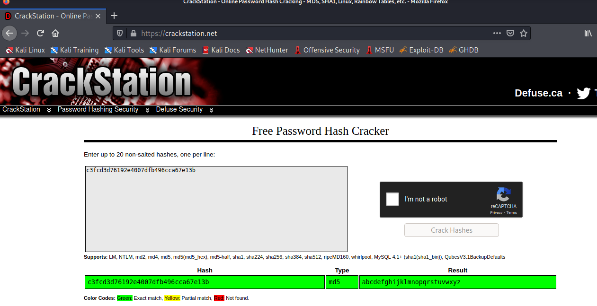

# Vulnhub : Mr Robot
***
This is one of the simple boxes you can solve without much effort. From the name itself, we get the reference; the tv series "Mr Robot".
<br><br>
## Recon
***
First we need to find the device on the network.

```bash
nmap 192.168.56.*
```


<br>From the result we can see that our vulnhub box has ip 192.168.56.127. Lets scan the device using nmap again

```bash
nmap 192.168.56.127 -sC -sV -oN nmap
```


<br>We have HTTP and HTTPS, but SSH is closed. Which means either the ssh is running on some other port **OR** SSH is closed and we need to find some other method to get inside.<br>

Lets visit the webpage first and see


<br>After some cool prompts we get this screen. (Kudos to the people who built this :D; it really good)
<br>
I've tried all the options here. I suggest you do the same.For the time being, lets see the **join** option.


Well, there is nothing much here.


<br>But if you observe, all options you select are some routes. Lets see if there are more routes.


<br>I'm using a tool called **gobuster** with a wordlist that comes preinstalled with kali.<br>

> Gobuster us a tool used to enumerate all routes of a webpage. You need to specify the url and a wordlist. There are other tools, i'll leave that upto you to explore.

```bash
gobuster dir -u http://192.168.56.127 -w /usr/share/wordlists/dirbuster/directory-list-2.3-medium.txt
```

First thing that I noticed was the **/wp-login** route. This indicates a wordpress site in running on the server.<br>

Also there is a **/blog**. Lets see if we can find something there.


<br>Guess what, we can't access that for the time being.<br>
Just out of curiosity, I visited **/0** route.


<br>And, there is our blog. It says its a wordpress site.<br>

Remember the gobuster I was running before. Well, new routes came up ! This is why you need to enumarate all routes before stopping the tool, you never know what will come up


<br>
**/robot** look intresting.Lets visit that.


<br>
Well there are two files here.
* fsocity.dic
* key-1-of-3.txt

Lets download and see the contents.


<br>
The dictionary has 858160 entries. Lets clean and see if there is any repetetions inside.


```bash
cat fsocity.dic | sort | uniq > sorted.txt
```
And there you go, after cleaning you get 11451 lines.
<br>
Since, now we have a wordlist lets check on the wordpress login.


<br>I tried using default credentials  like admin:admin, admin:password, root:password,root:toor. <br>
Nothing came up, the thing to note is that; error said **Invalid username** not **invalid username or password**.<br><br>
That means, we can check if a specific username exist, then bruteforce password for that account, rather that bruteforcing all usernames and passwords.
<br><br>
Since, it is based on the show, lets try **elliot**
<br>


<br>Our guess was correct. There is an user named **elliot**. Lets bruteforce the password.<br>

For this, I'll be using **wpscan**, you can even use **hydra**

```bash
wpscan -u http://192.168.56.127 --users elliot --passwords sorted.txt
```


<br>We got the password. Lets login and check.


<br><br>
## Getting user
***
Since SSH is closed, this might be our way to get inside the server.This is what we know so far
* SSH is closed
* No other ports run ssh
* We have compramised the wordpress site
* wordpress runs on PHP !!!

That's it !!! Since wordpress runs on PHP, why dont we place a reverse shell inside the site ?

```
Appearence ==> Editor ==> 404.php
```

404.php was the first file in the list so i've chose that, plus there are some other reasons too. This is the reverse shell that i'll be using


<br>
And when you call a routem that does not exist, 404.php is called and we get a shell


<br>

Lets see the home directory of users.

<br>There is a user called **robot** and the user has two files
* key-2-of-3.txt
* password.raw-md5

When we look into the password.raw-md5, it is indeed a MD5 sum of the password. We just need to crack it.<br>

I'll use a website called [crackstation.net](https://crackstation.net/) for the timebeing. 



<br>As you can see, we get the password : **abcdefghijklmnopqrstuvwxyz**
<br>
Lets login as robot with this password.


<br>
Here, i had to spawn a shell using python as a proper TTY was not present.<br>
```bash
python -c 'import pty;pty.spawn("/bin/bash")'
```

# Getting root


Lets see how we can get root.First as always, lets do sudo listing.

<br>
**robot**  cannot run sudo. Lets see if there is any binary that have the provision to run as other user. Such binaries with have a SUID and we can find them easily in linux.

```bash
find . -perm /4000 2>/dev/null
```


Out of all the above, **nmap** is the one that i find suspecious. First of all, nmap is not installed by default in linux; next it has sticky bit.
<br>

Lets pop a shell inside nmap

```bash
    nmap --interactive
```
```bash
    !sh
```

<br>
And there you have it. nmap has an effective id of **root** and opening a shell, gives us root privileges.

<br>
<br>
That winds up everything. This box has taught many tools and small techniques for better red teaming.<br>Keep learning
